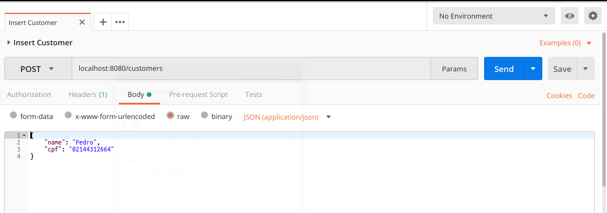
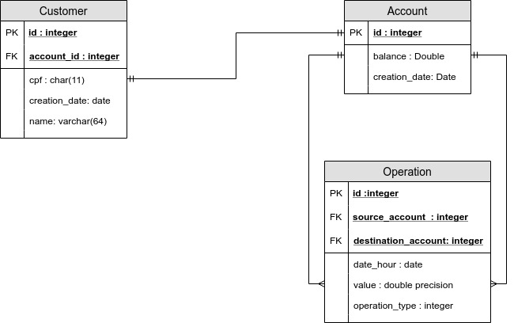

# Bank Simulator

<div align="center">
  <!-- Build Status -->
  <a href="https://travis-ci.org/marcosbarrazup/desafioprog">
    
  </a>

</div>

This project is a Bank System Simulator. With that simulator, you  can: 
- Insert customers (Auto-generated accounts)
- Make deposits
- Make withdrawals
- Make bank transfers
- Check your balance
- Check your bank statement

## Getting Started

These instructions will get you a copy of the project up and running on your local machine for development and testing purposes. 

### Prerequisites

What things you need to install the software and how to install them

* [Postgres](https://www.postgresql.org/download/) 
* [Docker Compose](https://docs.docker.com/compose/install/) 
* [Postman](https://www.getpostman.com/apps) 
* [IntelliJ IDEA](https://www.jetbrains.com/idea/) 


### Installing

This is a step by step guide for the simulator installation.

First, clone or download the simulator from this Github repository

Now, go to the project's folder with terminal and certify that your docker is running.
```
systemctl start docker.service
```

After, run the docker-compose
```
docker-compose up
```

Now, open the IntelliJ IDEA and run the runnable "DesafioProgApplication"


## Running the tests

Open the Postman and feel free to send these requests :D



- Insert Customers: **localhost:8080/customers** - POST -  With that  body the system will insert a customer: 
```
{
	"name": "Example",
	"cpf": "ValidCPF"
}
```
- List Customers: **localhost:8080/customers** - *GET* - With that request the system will show all the customers.


- Search Customer: **localhost:8080/customers/{{cpf}}** - *GET* - With that request and a registered CPF the  system will return that customer.


- Update Customer: **localhost:8080/customers/{{cpf}}** - *PUT* - With that request, a registered CPF and this body, you can update that customer:
```
{
	"name": "NewExampleName",
	"cpf": "NewValidCPF"
}
```


- Delete Customer: **localhost:8080/customers/{{cpf}}** - *DELETE* - With that request and registered CPF, you will delete that customer.


- List Accounts: **localhost:8080/accounts** - *GET* - With that request, the system will show all the accounts.


- Search Account: **localhost:8080/accounts/{{id}}** - *GET* - With that request and a valid Account ID, the system will return the associated account.


- Statement: **localhost:8080/accounts/{{id}}/statement** - *GET* - With that request and a valid Account ID, the system will show the associated bank statement.


- Deposit: **localhost:8080/accounts/{{id}}/deposit** - *POST* - With that request, a valid Account ID and this body, you will deposit on that account:
 ```
{
	"value": 100.0
}
```


- Transfer: **localhost:8080/accounts/{{id1}}/transfer/{{id2}}** - *POST* - With that request and two valids Account IDs, you will transfer from Account ID1 to Account ID2,  with this body:
 ```
{
	"value": 100.0
}
```


- Withdraw : **localhost:8080/accounts/{{id}}/withdraw** - *POST* - With that request and a valid Account ID, you will make a bank withdraw from the associated account, with this body:

 ```
{
	"value": 100.0
}
```

## Business Rules 

- Account balance should never be  negative;
- Should not be possible to make withdrawals or transfers with insufficient balance;
- Destination account should be valid;
- Client must have just one account (Validation by CPF);
- Return the account Id at the customer registration;
- At the bank statement, show all the account movement, like transfers, withdrawals and deposits;
- At the bank transfer, source and destination accounts must be valid; 
- Should not be possible to make a bank transfer to the same account.

## DER



## Built With

* [Spring Boot](http://spring.io/projects/spring-boot) - The application development platform
* [Maven](https://maven.apache.org/) - Dependency Management
* [Postgres](https://www.postgresql.org/about/) - An open source object-relational database system


## Author

* **Marcos Barra**  - [GitHub](https://github.com/marcosbarrazup)

